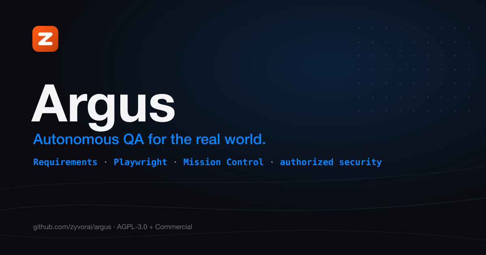
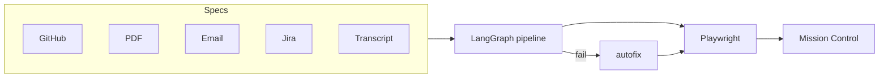

<!-- Copyright (c) 2026 ZyvorAI Labs Private Limited. -->
<!-- SPDX-License-Identifier: AGPL-3.0-only OR LicenseRef-Argus-Commercial -->
# Argus

[](https://github.com/zyvorai/argus/releases/latest)
[](https://github.com/zyvorai/argus/actions/workflows/ci.yml)
[](https://github.com/zyvorai/argus/actions/workflows/security.yml)
[](LICENSE)
[](pyproject.toml)
[](package.json)
[](playwright/)



**Autonomous QA for the real world.** Argus reads your requirements, scores them, generates Playwright tests, runs them on every deploy, and shows what broke — in Mission Control, a live ops console.

No LLM key required for smoke tests, rule-based parsing, and most dashboard actions. Add a provider when you want richer generation and analysis.


*Grouped side rail · dark theme · Ask Zyra · macOS Terminal live job · Search / ⌘K · 25+ actions*

## Contents

- [Quickstart](#-quickstart)
- [Mission Control](#-mission-control)
- [Architecture at a glance](#-architecture-at-a-glance)
- [Capabilities](#-capabilities)
- [Why Argus](#-why-argus)
- [Important boundaries](#-important-boundaries)
- [License](#-license)

## 🚀 Quickstart

Requires Python 3.10+, Node 20+, and Docker (only for the container path). `make install` handles the rest, including Playwright's Chromium download.

```bash
git clone https://github.com/zyvorai/argus.git && cd argus
cp .env.example .env          # set ZYVOR_BASE_URL
make install                    # Python venv + Playwright Chromium
argus test exec --grep @smoke   # first green run — no API key
argus serve --port 8080         # → http://localhost:8080/dashboard
```

**Remote deploy in one command:**

```bash
./scripts/deploy-remote.sh YOUR_HOST YOUR_USER --service --key
# Mission Control on port 30080 — credentials printed in deploy summary
```

Container:

```bash
docker pull ghcr.io/zyvorai/zyvor-argus:v0.9.2
docker run --rm -p 8080:8080 --env-file .env ghcr.io/zyvorai/zyvor-argus:v0.9.2 serve --port 8080 --host 0.0.0.0
```

| Track | Where |
| --- | --- |
| **Self-host from source** (AGPL, free for home) | This repo |
| **Commercial license (ACL)** — custom pricing | [sales@zyvor.dev](mailto:sales@zyvor.dev) · [COMMERCIAL_LICENSE.md](COMMERCIAL_LICENSE.md) |
| **Docs** | [Tutorials](docs/tutorials/README.md) · [zyvor.dev/docs](https://zyvor.dev/docs) |

More: [user manual](docs/user/README.md) · [feature guide](docs/zyvor-argus-user-feature-guide.md) · [configuration](docs/configuration.md) · [remote deploy](docs/remote-deploy.md) · [enterprise overlay](docs/enterprise-v2.md).

## 🖥 Mission Control

`argus serve` exposes **Mission Control** at `/dashboard`.

- **Grouped side rail** — Console (Overview, Ask Zyra) · Testing (Pipeline, Visual, Quality, Journeys, API, Probes, Requirements) · Security · Operations (Runs & schedules)
- **Header** — knowledge lamp, dark/light theme, Search (also **⌘K**)
- **Overview** — hero status, pass rate, next smoke, and a live macOS Terminal job panel (Copy / Save / Stop)
- **Hash routes** — `#pipeline`, `#ask`, `#requirements`, `#operations`

Full action list: [dashboard tutorial](docs/tutorials/10-mission-control-dashboard.md).

## 🗺 Architecture at a glance



```bash
argus test run --source github --spec docs/specs/feature.md
argus test run --source document --spec requirements/checkout.pdf
argus flow run https://zyvor.dev --steps docs/assets/zyvor-dev-demo.steps --video
```

Command reference: [docs/test-authoring.md](docs/test-authoring.md).

## 🧰 Capabilities

- **Requirements** — versioned, scored, and traced to every generated test, plus impact by shared data models and flows
- **One pipeline** — the same LangGraph path from the CLI or one dashboard click
- **Self-healing autofix** — suggests and applies repairs, then re-runs
- **Contracts** — OpenAPI contract test, breaking-change diff, and HAR consumer verify
- **Authorized security** — misconfig, CVE, SCA, DAST, LLM red-team, and chaos jobs with an audit trail and sandboxed PoC
- **Mission Control** — Console, Testing, Security, and Operations in one rail

Ask Zyra (optional knowledge extra): [docs/tutorials/14-ask-zyra-knowledge.md](docs/tutorials/14-ask-zyra-knowledge.md). What DAST covers, and what it deliberately defers: [docs/security-network-attack-gaps.md](docs/security-network-attack-gaps.md).

## ⚖ Why Argus

| | Without Argus | With Argus |
|---|---|---|
| Specs and tests | Drift apart | Requirements are versioned, scored, and traced |
| Smoke runs | A tribal ritual | One command, or one dashboard click |
| Flaky selectors | Waste the afternoon | Autofix suggests a repair and re-runs |
| API drift | Tribal knowledge | Contract test, OpenAPI diff, HAR verify |
| Security checks | Spreadsheets | Authorized jobs with an audit trail |
| Tooling | Five products | One Mission Control |

## 🔍 Important boundaries

What's free under AGPL vs. what needs a commercial license
([full guide](docs/LICENSING.md)):

| Use case | Allowed under AGPL? |
| --- | --- |
| Self-host for home or your own operations | Yes, free |
| Modify for internal use | Yes, free |
| Build and publish your own AGPL extensions | Yes, free |
| Deploy modified Argus as public SaaS without releasing changes | No — needs ACL |
| Embed Argus in a closed-source product | No — needs ACL |
| White-label proprietary customizations without AGPL | No — needs ACL |

Commercial pricing is custom. Contact [sales@zyvor.dev](mailto:sales@zyvor.dev).

## 📈 Star History

[](https://star-history.com/#zyvorai/argus&Date)

## 📄 License

Dual-licensed:

- **[AGPL-3.0](LICENSE)** — open source; free for home users and self-host under AGPL terms
- **[Argus Commercial License (ACL)](COMMERCIAL_LICENSE.md)** — proprietary integrations, freedom from AGPL obligations, support. **Custom pricing** — [sales@zyvor.dev](mailto:sales@zyvor.dev)

See [docs/LICENSING.md](docs/LICENSING.md). Contributions: [CLA.md](CLA.md) + [DCO.md](DCO.md) (`git commit -s`),
governed by our [Code of Conduct](CODE_OF_CONDUCT.md).
